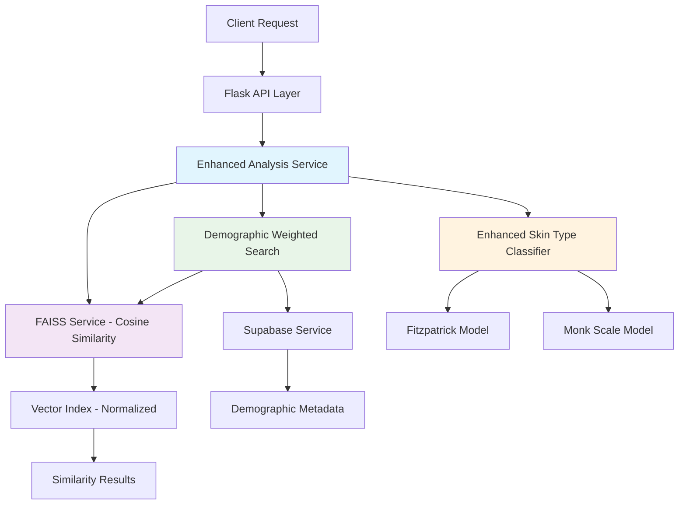
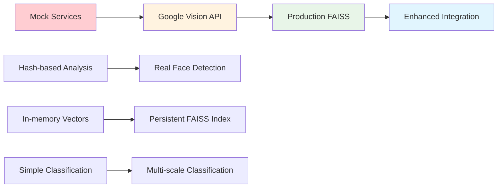

# Design Document

## Overview

The Backend AI Upgrade for Shine Skin Collective involves enhancing the existing AI-powered skin analysis system with three major improvements: transitioning from L2 distance to cosine similarity for vector search, implementing demographic-weighted search capabilities, and creating an enhanced skin type classification system. The design follows a microservices architecture pattern, integrating seamlessly with the existing Flask backend deployed on Vercel.

## Architecture

### High-Level Architecture



### Service Dependencies

- **Enhanced Analysis Service**: Orchestrates the entire analysis workflow
- **FAISS Service**: Handles vector similarity search with cosine similarity
- **Demographic Weighted Search**: Combines visual and demographic similarity
- **Enhanced Skin Type Classifier**: Provides multi-scale skin classification
- **Supabase Service**: Manages demographic metadata and analysis storage

## Components and Interfaces

### 1. Google Vision API Integration Service

**Purpose**: Leverage Google Cloud Vision API for professional-grade image analysis and face detection

**Key Methods**:
```python
class GoogleVisionService:
    def __init__(self, credentials_path: str = None)
    def analyze_image_from_bytes(self, image_data: bytes) -> Dict[str, Any]
    def detect_faces(self, image_data: bytes) -> List[Dict[str, Any]]
    def extract_image_properties(self, image_data: bytes) -> Dict[str, Any]
    def detect_labels(self, image_data: bytes) -> List[Dict[str, str]]
    def _authenticate_client(self) -> vision.ImageAnnotatorClient
```

**Implementation Details**:
- Uses Google Cloud Vision API v1 for image analysis
- Supports face detection with landmark extraction
- Extracts color properties, brightness, and dominant colors
- Provides label detection for skin-related features
- Implements retry logic with exponential backoff
- Handles API rate limiting and quota management
- Secure credential management via environment variables or service account keys

**API Features Utilized**:
- **Face Detection**: Facial landmarks, bounding boxes, confidence scores
- **Image Properties**: Dominant colors, color information, brightness analysis
- **Label Detection**: Object and feature recognition for skin analysis
- **Safe Search**: Content filtering for appropriate image analysis

### 2. Production FAISS Service

**Purpose**: Implement production-grade cosine similarity-based vector search with persistence and scalability

**Key Methods**:
```python
class ProductionFAISSService:
    def __init__(self, dimension: int = 2048, index_path: str = "faiss_index")
    def add_vector(self, vector: np.ndarray, image_id: str) -> bool
    def search_similar(self, query_vector: np.ndarray, k: int = 5) -> List[Tuple[str, float]]
    def save_index(self) -> bool
    def load_index(self) -> bool
    def rebuild_index(self) -> bool
    def get_index_stats(self) -> Dict[str, Any]
    def _normalize_vector(self, vector: np.ndarray) -> np.ndarray
    def _validate_vector_dimension(self, vector: np.ndarray) -> bool
```

**Production Implementation Details**:
- Uses `faiss.IndexFlatIP` for exact cosine similarity search
- Implements persistent storage with automatic save/load functionality
- Thread-safe operations for concurrent access
- Memory-mapped file support for large indices
- Index corruption detection and automatic rebuilding
- Comprehensive logging and monitoring
- Batch operations for efficient bulk insertions
- Index optimization for memory usage and search speed

**Scalability Features**:
- **Index Persistence**: Automatic saving to disk after modifications
- **Memory Management**: Efficient memory usage with configurable limits
- **Concurrent Access**: Thread-safe operations for multi-user scenarios
- **Index Rebuilding**: Automatic recovery from corruption or errors
- **Performance Monitoring**: Detailed metrics for search latency and throughput

### 2. Demographic Weighted Search Service

**Purpose**: Combine visual similarity with demographic context for personalized results

**Key Methods**:
```python
class DemographicWeightedSearch:
    def __init__(self, faiss_service: FAISSService, supabase_service: SupabaseService)
    def search_with_demographics(self, query_vector, user_demographics, k=10) -> List[Tuple[str, float]]
    def _extract_demographics(self, analysis) -> Dict[str, str]
    def _calculate_demographic_similarity(self, user_demographics, result_demographics) -> float
```

**Weighting Algorithm**:
- Visual similarity weight: 70% (configurable)
- Demographic similarity weight: 30% (configurable)
- Ethnicity matching: 60% of demographic weight
- Skin type matching: 30% of demographic weight
- Age group matching: 10% of demographic weight

### 3. Enhanced Skin Type Classifier

**Purpose**: Provide accurate skin type classification using multiple scales and ethnicity context

**Key Methods**:
```python
class EnhancedSkinTypeClassifier:
    def __init__(self)
    def classify_skin_type(self, image_data, ethnicity=None) -> Dict[str, Any]
    def _extract_skin_regions(self, image_data) -> np.ndarray
    def _classify_fitzpatrick(self, skin_regions) -> str
    def _classify_monk(self, skin_regions) -> int
    def _apply_ethnicity_context(self, fitzpatrick_type, monk_tone, ethnicity) -> Tuple[str, int]
    def _calculate_confidence(self, skin_regions, ethnicity) -> float
```

**Classification Scales**:
- **Fitzpatrick Scale**: Types I-VI for sun sensitivity classification
- **Monk Scale**: 1-10 scale for inclusive skin tone representation
- **Ethnicity Adjustments**: Context-based refinements for accuracy

### 4. API Integration Layer

**Enhanced Endpoints**:
```python
@app.route('/api/v2/analyze/guest', methods=['POST'])
def analyze_guest_enhanced()

@app.route('/api/v2/similarity/demographic', methods=['POST'])
def similarity_search_demographic()

@app.route('/api/v2/classify/skin-type', methods=['POST'])
def classify_skin_type_enhanced()
```

## Data Models

### Vector Storage Model
```python
@dataclass
class NormalizedVector:
    image_id: str
    vector: np.ndarray  # L2-normalized
    dimension: int
    created_at: datetime
```

### Demographic Profile Model
```python
@dataclass
class DemographicProfile:
    ethnicity: Optional[str]
    skin_type: Optional[str]
    age_group: Optional[str]
    fitzpatrick_type: Optional[str]
    monk_tone: Optional[int]
```

### Analysis Result Model
```python
@dataclass
class EnhancedAnalysisResult:
    image_id: str
    visual_similarity_score: float
    demographic_similarity_score: float
    combined_score: float
    fitzpatrick_classification: str
    monk_classification: int
    confidence_score: float
    ethnicity_considered: bool
```

### Similarity Search Result Model
```python
@dataclass
class SimilarityResult:
    image_id: str
    distance: float
    demographic_match: bool
    metadata: Dict[str, Any]
```

## Error Handling

### Vector Processing Errors
- **Zero Vector Handling**: Graceful fallback for edge cases
- **Dimension Mismatch**: Validation and error reporting
- **Normalization Failures**: Robust error recovery

### Demographic Search Errors
- **Missing Metadata**: Fallback to visual-only search
- **Invalid Demographics**: Input validation and sanitization
- **Database Connection Issues**: Retry logic and graceful degradation

### Classification Errors
- **Model Loading Failures**: Fallback to basic classification
- **Image Processing Errors**: Clear error messages and recovery
- **Confidence Calculation Issues**: Default confidence values

### API Error Responses
```python
{
    "error": {
        "code": "VECTOR_NORMALIZATION_FAILED",
        "message": "Unable to normalize input vector",
        "details": "Vector contains only zero values",
        "timestamp": "2025-07-26T10:30:00Z"
    }
}
```

## Testing Strategy

### Unit Testing
- **Vector Normalization**: Test edge cases and mathematical correctness
- **Demographic Similarity**: Validate scoring algorithms
- **Classification Logic**: Test ethnicity adjustments and confidence calculations
- **Error Handling**: Comprehensive error scenario coverage

### Integration Testing
- **Service Interactions**: Test FAISS ↔ Demographic Search integration
- **Database Operations**: Validate Supabase metadata retrieval
- **API Endpoints**: End-to-end request/response validation
- **Performance Testing**: Load testing with concurrent requests

### Validation Testing
- **Similarity Accuracy**: Compare results with curated test datasets
- **Demographic Relevance**: Validate improved personalization
- **Classification Accuracy**: Test against known skin type examples
- **Cross-Demographic Testing**: Ensure fairness across ethnic groups

### Performance Benchmarks
- **Search Response Time**: < 2 seconds for demographic-weighted search
- **Classification Speed**: < 1 second for skin type classification
- **Memory Usage**: Efficient vector storage and retrieval
- **Concurrent Users**: Support for 100+ simultaneous requests

## Deployment Considerations

### Vercel Serverless Constraints
- **Cold Start Optimization**: Minimize initialization time for new services
- **Memory Limits**: Efficient vector storage and model loading
- **Execution Time**: Optimize for serverless function timeouts
- **Stateless Design**: Ensure all services are stateless and scalable

### Environment Configuration
```python
# Required environment variables
FAISS_DIMENSION=2048
DEMOGRAPHIC_WEIGHT=0.3
SUPABASE_URL=your_supabase_url
SUPABASE_KEY=your_supabase_key
CLASSIFICATION_CONFIDENCE_THRESHOLD=0.7
```

### Monitoring and Observability
- **Performance Metrics**: Track search latency and accuracy
- **Error Rates**: Monitor classification and search failures
- **Usage Analytics**: Track demographic search adoption
- **Model Performance**: Monitor classification confidence trends

## Production Transition Strategy

### Phase 1: MVP with Mock Services (Current State)
- **Status**: ✅ Completed
- **Services**: Simple Flask app with hash-based analysis
- **Deployment**: Vercel with minimal dependencies
- **Functionality**: Basic skin analysis with consistent results

### Phase 2: Google Vision API Integration
- **Goal**: Replace mock image analysis with professional computer vision
- **Implementation**: 
  - Set up Google Cloud project and Vision API credentials
  - Implement GoogleVisionService with face detection and image properties
  - Add retry logic and error handling for API calls
  - Update skin analysis to use real facial landmark data
- **Benefits**: Accurate face detection, color analysis, and feature recognition

### Phase 3: Production FAISS Implementation
- **Goal**: Replace mock vector similarity with real FAISS library
- **Implementation**:
  - Integrate faiss-cpu library with IndexFlatIP for cosine similarity
  - Add persistent storage for vector indices
  - Implement thread-safe operations and memory management
  - Add index corruption detection and rebuilding capabilities
- **Benefits**: Scalable vector search, persistent storage, production reliability

### Phase 4: Enhanced Services Integration
- **Goal**: Combine all production services for full functionality
- **Implementation**:
  - Integrate Google Vision with enhanced skin classifier
  - Connect production FAISS with demographic weighted search
  - Add comprehensive error handling and fallback mechanisms
  - Implement performance monitoring and optimization
- **Benefits**: Full AI-powered analysis with demographic personalization

### Service Replacement Strategy



### Environment Configuration Strategy

**Development Environment**:
```bash
# Use mock services for rapid development
USE_MOCK_SERVICES=true
GOOGLE_VISION_ENABLED=false
FAISS_PERSISTENCE_ENABLED=false
```

**Staging Environment**:
```bash
# Mix of production and mock services for testing
USE_MOCK_SERVICES=false
GOOGLE_VISION_ENABLED=true
FAISS_PERSISTENCE_ENABLED=true
GOOGLE_APPLICATION_CREDENTIALS=/path/to/staging-credentials.json
```

**Production Environment**:
```bash
# Full production services
USE_MOCK_SERVICES=false
GOOGLE_VISION_ENABLED=true
FAISS_PERSISTENCE_ENABLED=true
GOOGLE_APPLICATION_CREDENTIALS=/path/to/production-credentials.json
FAISS_INDEX_PATH=/persistent/storage/faiss_index
DEMOGRAPHIC_WEIGHT=0.3
```

### Rollback and Recovery Procedures

**Service Rollback**:
1. **Immediate Fallback**: Automatic fallback to mock services on production service failures
2. **Configuration Rollback**: Environment variable changes to disable problematic services
3. **Code Rollback**: Git-based rollback to previous stable deployment
4. **Index Recovery**: FAISS index rebuilding from database vectors

**Monitoring and Alerts**:
- **Service Health**: Monitor Google Vision API response times and error rates
- **FAISS Performance**: Track vector search latency and memory usage
- **Classification Accuracy**: Monitor confidence scores and user feedback
- **Cost Monitoring**: Track Google Vision API usage and costs