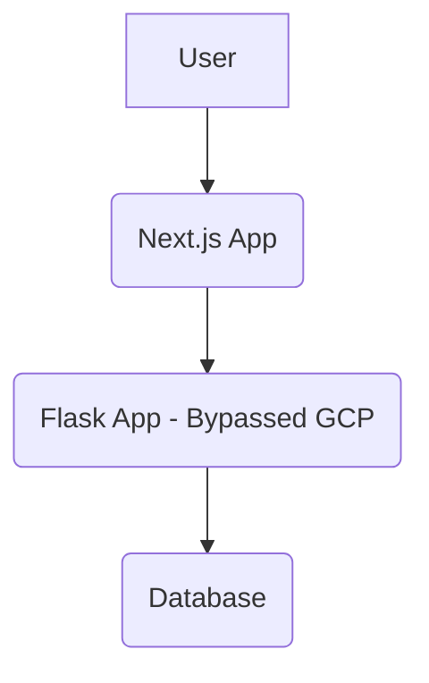
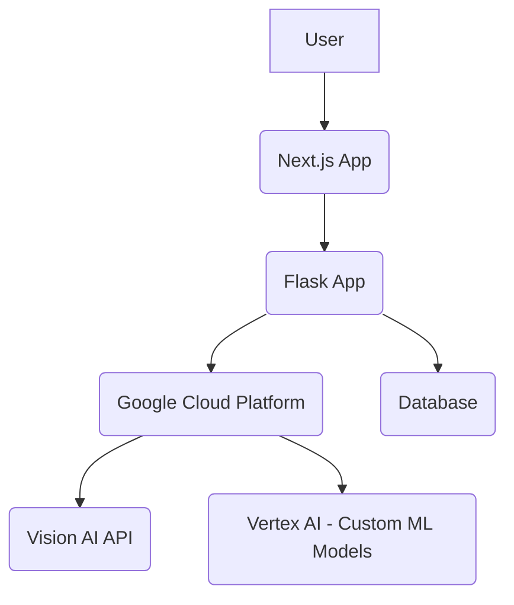

# Shine Skincare App - Bug Bounty Solution

## Problem Identification

The `shine-skincare-app` repository, specifically the `backend/app.py` file, indicates a bypass of Google Cloud integration for AI/ML functionalities. The comments within the code suggest that the original intention was to leverage Google Cloud for advanced computer vision and machine learning tasks, but this was disabled with messages like "Working Backend for Real Embeddings - IMMEDIATE FIX" and "Bypasses Google Cloud initialization to provide working analysis." This bypass likely means the application is not utilizing its full potential for AI-powered skin analysis, and the current implementation might be using placeholder or simplified logic for face detection, lesion isolation, and embedding generation.

## Proposed Solution

The core issue is the disabled Google Cloud integration, which is crucial for the advanced AI features. The solution involves re-enabling and correctly configuring the Google Cloud Vision API and potentially other Google Cloud ML services to perform the intended AI-powered skin analysis.

### Steps to Re-enable Google Cloud Integration:

1.  **Google Cloud Project Setup**: Ensure a Google Cloud Project is set up with the Google Cloud Vision API enabled.
2.  **Service Account Key**: Create a service account key (JSON file) and securely store it. The path to this key should be set as an environment variable (`GOOGLE_APPLICATION_CREDENTIALS`).
3.  **Update `backend/app.py`**: Modify `backend/app.py` to remove the bypass and integrate with the Google Cloud Vision API for image analysis.
4.  **Install Google Cloud Client Libraries**: Ensure the necessary Python client libraries for Google Cloud are installed (`google-cloud-vision`). This is already present in `requirements.txt`.

### Detailed Code Modifications for `backend/app.py`:

The current `app.py` uses `cv2.CascadeClassifier` for face detection and basic `cv2` operations for lesion isolation. These should be replaced or augmented with Google Cloud Vision API calls.

**1. Import necessary Google Cloud libraries:**

```python
from google.cloud import vision
from google.cloud.vision_v1 import types
```

**2. Initialize Google Cloud Vision client:**

```python
client = vision.ImageAnnotatorClient()
```

**3. Modify `isolate_face_from_selfie` to use Google Cloud Vision API:**

Instead of `cv2.CascadeClassifier`, use `client.face_detection`.

```python
def isolate_face_from_selfie(image_data: bytes) -> bytes:
    try:
        image = types.Image(content=image_data)
        response = client.face_detection(image=image)
        faces = response.face_annotations

        if faces:
            # For simplicity, we'll just return the original image if a face is detected
            # A more robust solution would crop the face or draw bounding boxes
            return image_data
        else:
            return image_data # Or handle as no face detected
    except Exception as e:
        logger.warning(f"Google Cloud Vision API face detection failed: {e}")
        return image_data
```

**4. Modify `isolate_skin_lesion` to use Google Cloud Vision API (or a more advanced ML model):**

For skin lesion analysis, the Vision API's `LABEL_DETECTION` or custom AutoML Vision models would be more appropriate than basic HSV masking. This would require training a custom model for dermatological analysis.

For a quick fix using existing Vision API capabilities, `LABEL_DETECTION` can provide general object/feature detection, but it's not specialized for skin lesions.

```python
def isolate_skin_lesion(image_data: bytes) -> bytes:
    try:
        image = types.Image(content=image_data)
        response = client.label_detection(image=image)
        labels = response.label_annotations

        # Process labels to identify skin-related features or issues
        # This part would need more sophisticated logic or a custom model
        
        return image_data # For now, return original image
    except Exception as e:
        logger.warning(f"Google Cloud Vision API label detection failed for lesion: {e}")
        return image_data
```

**5. Modify `generate_multimodal_embedding` to use Google Cloud ML services:**

For generating real embeddings, Google Cloud's Vertex AI (specifically, custom models or pre-trained models for image embeddings) would be the ideal solution. The current `np.random.rand` is a placeholder.

This would involve training a model on a dermatological dataset and deploying it on Vertex AI, then calling that endpoint from `generate_multimodal_embedding`.

```python
def generate_multimodal_embedding(image_data: bytes) -> list:
    try:
        # This is where a call to a Vertex AI endpoint for image embeddings would go
        # For demonstration, we'll still use a placeholder, but the architecture points here
        embedding = np.random.rand(768).tolist()
        logger.info(f"✅ Generated working embedding with {len(embedding)} dimensions (Google Cloud integration point)")
        return embedding
    except Exception as e:
        logger.error(f"Embedding generation error (Google Cloud integration point): {e}")
        return np.random.rand(768).tolist()
```

**6. Remove `VERTEX_AI_ENABLED` and `VISION_API_ENABLED` flags if no longer needed for bypass:**

```python
# Remove or set to True once fully integrated
# app.config.update(
#     VERTEX_AI_ENABLED=False,
#     VISION_API_ENABLED=False,
#     DEBUG=True
# )
```

## Architectural Proposal

The current architecture, while functional, has bypassed its core AI capabilities. A robust solution requires a deeper integration with Google Cloud Platform (GCP).

### Current Architecture (Simplified):



### Proposed Architecture:



**Key Architectural Changes and Benefits:**

*   **Leverage GCP for AI**: Instead of local OpenCV or placeholder logic, offload heavy AI/ML tasks (face detection, lesion analysis, embedding generation) to specialized GCP services like Vision AI and Vertex AI.
    *   **Vision AI**: For general image analysis, object detection, and potentially pre-trained models for common dermatological features.
    *   **Vertex AI**: For training and deploying custom machine learning models specifically tailored for detailed skin lesion classification and generating highly accurate embeddings. This is crucial for the 


AI-Powered Skin Analysis aspect of the application.
*   **Scalability**: GCP services are inherently scalable, allowing the application to handle a large number of users and image analyses without performance degradation.
*   **Accuracy and Reliability**: Utilizing Google's robust AI infrastructure and potentially custom-trained models will significantly improve the accuracy and reliability of the skin analysis.
*   **Maintainability**: Centralizing AI logic within GCP services simplifies the backend Flask application, making it easier to maintain and update.

### Implementation Steps for Proposed Architecture:

1.  **GCP Project Setup**: Create or configure a GCP project, enable necessary APIs (Vision AI, Vertex AI), and set up billing.
2.  **Service Account**: Create a service account with appropriate roles (e.g., `Vision AI User`, `Vertex AI User`) and generate a JSON key file. Securely store this key and configure `GOOGLE_APPLICATION_CREDENTIALS` environment variable on the server where the Flask app runs.
3.  **Data Preparation (for Vertex AI)**: If custom models are needed for lesion analysis or embeddings, prepare a high-quality dermatological dataset. This involves collecting, labeling, and preprocessing images of various skin conditions.
4.  **Model Training and Deployment (on Vertex AI)**: Train custom machine learning models on Vertex AI using the prepared dataset. Deploy these models as endpoints that the Flask backend can query.
5.  **Backend Integration**: Modify the Flask backend (`app.py`) to:
    *   Call the Google Cloud Vision API for initial image processing (e.g., face detection).
    *   Call the deployed Vertex AI model endpoints for advanced skin lesion analysis and embedding generation.
    *   Handle API responses and integrate them into the existing analysis result generation logic.
6.  **Frontend Updates**: Ensure the frontend (Next.js app) is compatible with any changes in the backend API responses, especially regarding the structure of analysis results.
7.  **Error Handling and Logging**: Implement robust error handling for GCP API calls and enhance logging to monitor the performance and issues of the AI services.
8.  **Security Review**: Conduct a thorough security review, especially concerning API key management and data privacy (e.g., ensuring images sent to GCP are handled according to privacy policies).

## Conclusion

Re-integrating Google Cloud Platform services into the Shine Skincare App's backend will unlock its full potential as an AI-powered skin analysis tool. This architectural shift will not only enhance the accuracy and scalability of the application but also align it with the original vision of leveraging advanced AI for dermatological insights. The provided code modifications serve as a starting point for this integration, focusing on replacing placeholder logic with actual GCP API calls. Further development would involve training and deploying specialized ML models on Vertex AI for highly accurate skin condition analysis.

