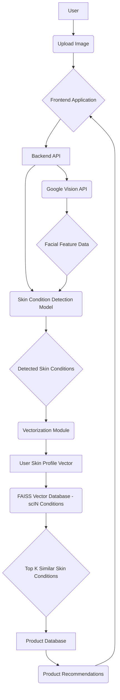
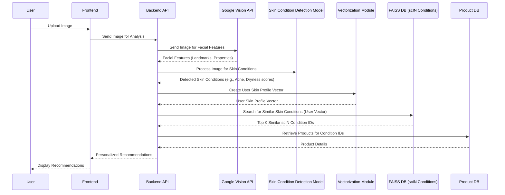

# Vector Database Architecture for Skincare Recommendations

## 1. Introduction

This document outlines the revised design for a vector database architecture to support AI-powered skincare recommendations within the Shine Skincare App. The core objective is to leverage facial analysis data, primarily for detecting skin conditions like acne and dryness, and then use the `scIN` dataset of skin conditions with cosine similarity search to recommend suitable products. Google Vision API will play a supporting role in facial feature detection.

## 2. Data Sources and Integration

### 2.1 Google Vision API for Facial Feature Detection

The Google Vision API will be utilized to extract key facial features and characteristics from user-uploaded images. Its role is primarily to assist in identifying the presence and location of facial features, which can then be used by other models to detect skin conditions. While Google Vision API offers various features, for this application, the focus will be on:

*   **Landmarks**: Detection of facial landmarks (e.g., eyes, nose, mouth, chin) to accurately locate and crop areas of interest for skin analysis.
*   **Properties**: Dominant colors in the image, which can be indicative of overall skin tone and potentially help in normalizing images for skin condition detection.

It's important to reiterate that direct 'race' or 'skin type' classification from Google Vision API is not the primary goal due to ethical considerations and potential biases [6, 7]. Instead, the API will provide foundational facial data for subsequent, more specialized skin condition analysis.

### 2.2 Skin Condition Dataset (scIN) and Product Data

The `scIN` dataset, confirmed to be a collection of skin conditions, is central to the recommendation system. This dataset, available in a Google Cloud bucket, is assumed to contain rich metadata about various skin conditions, including:

*   **Condition Name** (e.g., Acne, Dryness, Hyperpigmentation, Rosacea)
*   **Visual Characteristics** (e.g., redness, bumps, flakiness, dark spots)
*   **Associated Symptoms**
*   **Recommended Ingredients/Treatments**
*   **Vector Embeddings**: Pre-computed vectors representing the characteristics of each skin condition.

Separately, there will be a product database (likely Supabase as per the `README.md`) containing information about skincare products. Each product will be linked to the skin conditions it addresses and will also have its own vector embeddings. The product data will include:

*   **Product Name**
*   **Brand**
*   **Ingredients**
*   **Target Skin Concerns/Conditions** (e.g., addresses acne, suitable for dry skin)
*   **Suitable Skin Types**
*   **Product Type**
*   **Key Benefits**
*   **Usage Instructions**
*   **Vector Embeddings**: Representing the product's properties and target conditions.

## 3. Vectorization Strategy

To enable cosine similarity search, both the detected skin conditions from user images and the `scIN` skin condition data (and subsequently, product data) need to be represented as numerical vectors.

### 3.1 Skin Condition Vectorization from User Image

This is the crucial step where the user's uploaded image is analyzed to identify present skin conditions. This will likely involve a custom computer vision model trained on a diverse dataset of skin images labeled with various conditions (acne, dryness, redness, etc.). The process would be:

1.  **Image Preprocessing**: Use Google Vision API's facial landmark detection to align and crop the face, ensuring consistent input for the skin condition detection model.
2.  **Skin Condition Detection Model**: A specialized model (e.g., a Convolutional Neural Network - CNN) will analyze the preprocessed image to identify and quantify the presence and severity of various skin conditions (e.g., a score for acne, a score for dryness, etc.).
3.  **Vector Embedding Generation**: The output of the skin condition detection model (e.g., a multi-dimensional array of scores for different conditions) will be transformed into a fixed-size vector embedding. This vector will represent the user's unique skin condition profile.

    The dimensionality of this vector (`FAISS_DIMENSION` is 2048) suggests that this embedding will be quite rich, capturing subtle nuances of skin conditions. This vector will be the 


query vector for the cosine similarity search against the `scIN` dataset.

### 3.2 scIN Skin Condition Vectorization

The `scIN` dataset already contains pre-computed vector embeddings for various skin conditions. These vectors are assumed to be generated in a way that allows for meaningful cosine similarity comparisons with the user's skin condition vector. The quality of these embeddings is critical for accurate recommendations.

### 3.3 Product Vectorization

Skincare products will also have vector embeddings. These embeddings should reflect the product's efficacy against specific skin conditions, its ingredients, and other relevant attributes. When a skin condition is identified, the system will then recommend products that have high cosine similarity to that condition, or products specifically formulated to address that condition.

## 4. Vector Database (FAISS) Implementation

FAISS (Facebook AI Similarity Search) will be used to efficiently search the `scIN` skin condition vector database. The `README.md` indicates that FAISS is already in use, with `FAISS_INDEX_PATH` and `FAISS_DIMENSION` defined.

### 4.1 Index Structure

The FAISS index will primarily store the vector embeddings of the skin conditions from the `scIN` dataset. The choice of FAISS index type will depend on the dataset size and performance requirements. Given the mention of cosine similarity, an `IndexFlatIP` (Inner Product) or `IndexFlatL2` (Euclidean distance) with normalized vectors would be appropriate.

### 4.2 Index Management

*   **Loading**: The FAISS index for skin conditions will be loaded from the specified `FAISS_INDEX_PATH` (likely a file in the Google Cloud bucket) into memory when the backend service starts.
*   **Updating**: A process will be needed to periodically update the FAISS index as new skin conditions are added to the `scIN` dataset or existing condition information changes.

## 5. Cosine Similarity Search for Recommendations

The core of the recommendation system will be the cosine similarity search. Once a user's skin condition profile is vectorized, this vector will be used as a query against the FAISS index containing the `scIN` skin condition vectors.

### 5.1 Search Process

1.  **User Image Upload**: A user uploads an image for skin analysis.
2.  **Facial Feature Detection (Google Vision)**: The backend sends the image to the Google Vision API to detect facial landmarks and properties, which helps in preparing the image for skin condition analysis.
3.  **Skin Condition Detection**: A custom model analyzes the image (preprocessed using Google Vision data) to identify and quantify various skin conditions (e.g., acne, dryness, redness).
4.  **Vectorization**: The detected skin conditions are transformed into a fixed-size vector embedding, representing the user's skin profile.
5.  **Normalization**: Both the query vector (user's skin profile) and the `scIN` skin condition vectors in the FAISS index must be L2-normalized.
6.  **FAISS Search**: The vectorized user skin profile is used as a query to perform a k-nearest neighbors (k-NN) search on the FAISS index of `scIN` skin conditions. This will return the top `k` most similar skin conditions.
7.  **Product Recommendation Generation**: Based on the identified skin conditions, the system will query the product database to find products specifically formulated for those conditions. This might involve another cosine similarity search if products also have embeddings related to the conditions they treat, or a direct lookup based on condition tags.
8.  **Recommendation Display**: The retrieved products are presented to the user as personalized recommendations, along with explanations of why they are suitable.

## 6. Diagrams

### 6.1 High-Level System Architecture (Revised)

This diagram illustrates the overall flow of data within the Shine Skincare App, with a focus on skin condition analysis and product recommendations.



### 6.2 Data Flow for Skin Analysis and Recommendation (Revised)

This diagram provides a more detailed view of the data processing steps involved in generating skincare recommendations, emphasizing the role of the `scIN` dataset.



## 7. Developer Instructions and Next Steps (Revised)

This section provides detailed instructions for developers to implement the described architecture, focusing on skin condition analysis, `scIN` dataset integration, and optional user inputs.

### 7.1 Backend Development (Python/Flask)

#### 7.1.1 Google Vision API Integration (Supporting Role)

1.  **Authentication**: Ensure `GOOGLE_APPLICATION_CREDENTIALS` environment variable points to the correct JSON key file for your Google Cloud project. This file should **not** be committed to the repository.

    ```bash
    export GOOGLE_APPLICATION_CREDENTIALS="/path/to/your/keyfile.json"
    ```

2.  **Install Google Cloud Client Library**: If not already installed, add the Google Cloud Vision API client library to `requirements.txt` and install it.

    ```bash
    pip install google-cloud-vision
    ```

3.  **Implement Facial Feature Extraction**: Create a dedicated module (e.g., `app/services/vision_utils.py`) to handle Google Vision API calls for facial landmark and property detection. This module will primarily provide pre-processing data for the skin condition detection model.

    ```python
    # Example snippet for vision_utils.py
    from google.cloud import vision
    import io

    def get_facial_features(image_content):
        client = vision.ImageAnnotatorClient()
        image = vision.Image(content=image_content)
        response = client.face_detection(image=image)
        # Extract landmarks, bounding boxes, and dominant colors
        return response.face_annotations, response.image_properties_annotation
    ```

#### 7.1.2 Skin Condition Detection Model Integration

1.  **Develop/Integrate Skin Condition Model**: This is the most critical component. A custom computer vision model (e.g., a pre-trained CNN fine-tuned on a skin condition dataset) needs to be developed or integrated. This model will take a facial image (potentially preprocessed using Google Vision data) and output scores or probabilities for various skin conditions (acne, dryness, redness, etc.).

    *   **Model Training**: If developing, ensure the model is trained on a diverse dataset of facial images with annotated skin conditions.
    *   **Model Deployment**: The model should be deployed in a way that the Flask backend can efficiently call it (e.g., as a TensorFlow Serving or PyTorch JIT service, or directly loaded if lightweight).

2.  **Create Skin Condition Analyzer Module**: Implement a module (e.g., `app/services/skin_condition_analyzer.py`) that encapsulates the logic for calling this model and interpreting its output.

    ```python
    # Example snippet for skin_condition_analyzer.py
    def analyze_skin_conditions(processed_image):
        # Call your custom skin condition detection model here
        # Returns a dictionary or array of scores/probabilities for conditions
        return {"acne": 0.7, "dryness": 0.3, "redness": 0.5}
    ```

#### 7.1.3 Vectorization Module (User Skin Profile)

1.  **Create User Skin Profile Vector**: In `app/services/vectorizer.py`, transform the output from `skin_condition_analyzer.py` into a fixed-size vector embedding. This vector should represent the user's skin condition profile and be compatible with the `scIN` dataset embeddings.

2.  **Ensure Compatibility**: The output vector must have the same `FAISS_DIMENSION` (2048) as the `scIN` skin condition embeddings. This might involve mapping the condition scores to a higher-dimensional space or using a pre-trained embedding model.

3.  **Normalization**: Implement L2 normalization for the user skin profile vector before performing the FAISS search.

    ```python
    import numpy as np

    def create_user_skin_profile_vector(skin_condition_scores):
        # Convert skin_condition_scores to a numpy array and potentially expand dimensions
        user_vector = np.array(list(skin_condition_scores.values())) # Example, needs more sophisticated mapping
        # Ensure user_vector matches FAISS_DIMENSION, e.g., by padding or using a mapping function
        # user_vector = map_to_faiss_dimension(user_vector)
        user_vector = user_vector / np.linalg.norm(user_vector) # L2 Normalization
        return user_vector
    ```

#### 7.1.4 FAISS Integration (scIN Skin Conditions)

1.  **Load FAISS Index**: In the backend application startup, load the FAISS index for `scIN` skin conditions from the `FAISS_INDEX_PATH` (which should point to the Google Cloud bucket location). Ensure `faiss-cpu` or `faiss-gpu` is installed.

    ```python
    import faiss
    # ... code to download index from GCS bucket to local path ...
    scin_faiss_index = faiss.read_index("local/path/to/scin_faiss_index")
    ```

2.  **Implement Search Endpoint**: Modify the `/api/analysis/upload` endpoint (or create a new one like `/api/analysis/skin`) to:
    *   Receive the uploaded image.
    *   Call `vision_utils` for facial features.
    *   Call `skin_condition_analyzer` to detect skin conditions.
    *   Generate the user skin profile vector using the `vectorizer`.
    *   Perform the FAISS search on `scin_faiss_index` (`scin_faiss_index.search(user_vector, k)`). This will return similar *skin conditions* from the `scIN` dataset.
    *   Based on the identified similar `scIN` conditions, query the product database to find relevant products. This step might involve a mapping from `scIN` condition IDs to product IDs, or another vector search if products are also vectorized based on their target conditions.
    *   Return personalized recommendations.

### 7.2 Frontend Development (Next.js/React)

#### 7.2.1 Optional Ethnicity and Age Input Fields

1.  **Update Skin Analysis Form**: In the skin analysis page (`app/skin-analysis/page.tsx` or similar), add optional input fields for ethnicity and age. These should be standard HTML input elements (e.g., `<select>` for ethnicity, `<input type="number">` for age).

    ```typescript
    // Example in app/skin-analysis/page.tsx
    <label htmlFor="ethnicity">Ethnicity (Optional):</label>
    <select id="ethnicity" name="ethnicity">
      <option value="">Select...</option>
      <option value="asian">Asian</option>
      <option value="black">Black</option>
      <option value="hispanic">Hispanic/Latino</option>
      <option value="middle_eastern">Middle Eastern</option>
      <option value="white">White</option>
      <option value="other">Other</option>
    </select>

    <label htmlFor="age">Age (Optional):</label>
    <input type="number" id="age" name="age" min="0" max="120" />
    ```

2.  **Send Data to Backend**: Ensure these optional fields are included in the data sent to the backend analysis endpoint. They can be part of the `FormData` object along with the image.

3.  **Backend Processing**: On the backend, these fields can be used to refine recommendations (e.g., certain skin conditions or product efficacies might vary with age or ethnicity). However, ensure that this data is used ethically and does not introduce bias.

### 7.3 Deployment (AWS Elastic Beanstalk)

1.  **Environment Variables**: Configure all necessary environment variables, including `GOOGLE_APPLICATION_CREDENTIALS`, `FAISS_INDEX_PATH`, `FAISS_DIMENSION`, and any new variables for the skin condition model, in the AWS Elastic Beanstalk environment settings.

2.  **Model Deployment**: If the skin condition detection model is a separate service, ensure it is properly deployed and accessible from the Elastic Beanstalk environment.

3.  **Scalability**: Monitor the performance of the skin condition detection model and FAISS search. Implement caching or asynchronous processing for long-running tasks.

### 7.4 Testing

1.  **Unit Tests**: Write unit tests for all new and modified modules, especially for the skin condition detection and vectorization logic.

2.  **Integration Tests**: Develop integration tests to verify the end-to-end flow, from image upload and optional input to recommendation display.

3.  **Performance Testing**: Conduct performance tests to assess the latency of the analysis and recommendation process.

4.  **Ethical Review**: Continuously review the recommendations for fairness and bias, especially concerning different skin tones, ages, and ethnicities. Ensure that the use of optional age and ethnicity inputs enhances personalization without leading to discriminatory outcomes. This is a critical step and may require A/B testing and user feedback.

## 8. References

[1] Google Cloud Vision API Documentation: [https://cloud.google.com/vision/docs](https://cloud.google.com/vision/docs)

[2] FAISS GitHub Repository: [https://github.com/facebookresearch/faiss](https://github.com/facebookresearch/faiss)

[3] Fitzpatrick Skin Type Scale: [https://en.wikipedia.org/wiki/Fitzpatrick_scale](https://en.wikipedia.org/wiki/Fitzpatrick_scale)

[4] Monk Skin Tone Scale: [https://skintone.google/](https://skintone.google/)

[5] Google Cloud Storage Documentation: [https://cloud.google.com/storage/docs](https://cloud.google.com/storage/docs)

[6] Google apologizes after its Vision AI produced racist results: [https://algorithmwatch.org/en/google-vision-racism/](https://algorithmwatch.org/en/google-vision-racism/)

[7] Google Cloud Vision API Won't Tag Images by Gender: [https://www.businessinsider.com/google-cloud-vision-api-wont-tag-images-by-gender-2020-2](https://www.businessinsider.com/google-cloud-vision-api-wont-tag-images-by-gender-2020-2)


