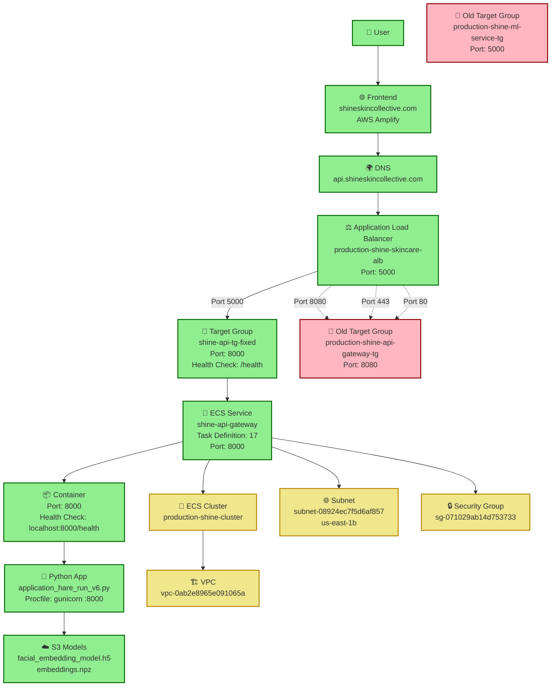

# 🏗️ Shine Skincare App Infrastructure Diagram

## Current Production Architecture

## 🔧 **Current Configuration Status**

### ✅ **Working Components:**
- **Frontend:** AWS Amplify hosting
- **DNS:** `api.shineskincollective.com` → ALB
- **ALB:** `production-shine-skincare-alb`
- **Target Group:** `shine-api-tg-fixed` (port 8000)
- **ECS Service:** `shine-api-gateway` (port 8000)
- **Backend:** Python app on port 8000

### ❌ **Issues Fixed:**
- **ALB Listener:** Updated to forward port 5000 → `shine-api-tg-fixed`
- **Port Mismatch:** ECS service updated from port 5000 → 8000
- **Task Definition:** Created revision 17 with correct port configuration

### 🔄 **Current Status:**
- **Deployment:** In progress (ECS rolling out new configuration)
- **Target Health:** Transitioning between targets
- **Health Endpoint:** Not yet responding (container startup in progress)

## 🚀 **Traffic Flow**

1. **User** → Frontend (Amplify)
2. **Frontend** → DNS (`api.shineskincollective.com`)
3. **DNS** → ALB (port 5000)
4. **ALB** → Target Group `shine-api-tg-fixed` (port 8000)
5. **Target Group** → ECS Service (port 8000)
6. **ECS Service** → Container (port 8000)
7. **Container** → Python App (port 8000)
8. **Python App** → S3 Models

## 📊 **Port Configuration Summary**

| Component | Port | Status |
|-----------|------|---------|
| ALB Listener | 5000 | ✅ Forwarding to correct target group |
| Target Group | 8000 | ✅ Health checks on port 8000 |
| ECS Service | 8000 | ✅ Updated from port 5000 |
| Container | 8000 | ✅ Exposed on port 8000 |
| Python App | 8000 | ✅ Running on port 8000 |

## 🎯 **Next Steps**

1. **Wait for deployment completion** (5-10 minutes)
2. **Verify target health** becomes `healthy`
3. **Test health endpoint** `http://api.shineskincollective.com/health`
4. **Validate face detection** working in production
